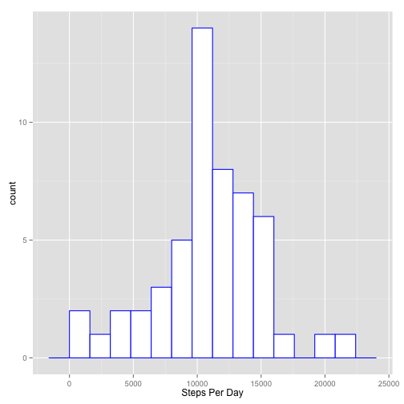
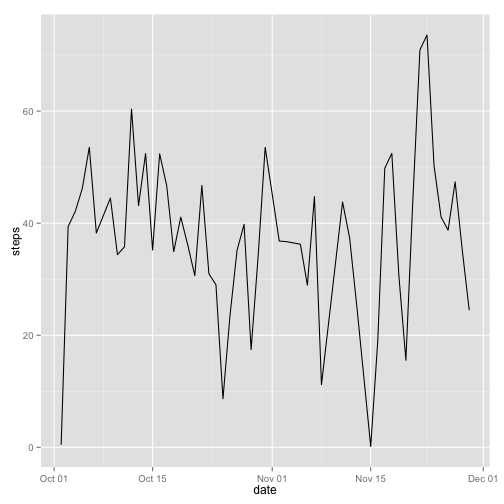
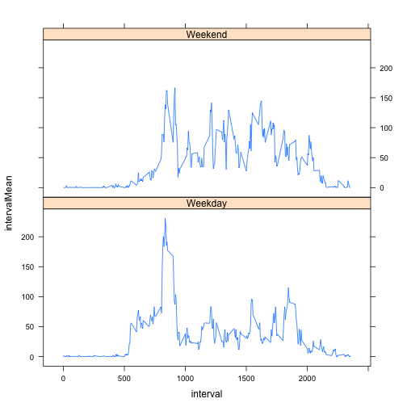

Jay's Peer Assessment file 1
========================================================

Set working directory, download the data, unzip the files, read in the data:


```r
setwd("~/Documents/R/repdata")
url <- "https://d396qusza40orc.cloudfront.net/repdata%2Fdata%2Factivity.zip"
download.file(url, destfile="activity.zip", method="curl")
unzip("activity.zip")
activity <- read.csv("activity.csv")
```


summarize data

```r
library(plyr)
activity$date <- as.Date(activity$date)
# activity$interval <- strptime(activity$interval, "%H%M")
perDay <- ddply(activity, 
                ~date, 
                summarise, 
                stepsSum = sum(steps),
                stepsMean = mean(steps, na.rm =TRUE),
                stepsMedian = median(steps, na.rm =TRUE))
```

make a histogram of steps per day

```r
library(ggplot2)
ggplot(perDay, aes(stepsSum)) +
geom_histogram(binwidth = 1600,
               colour = "blue",
               fill = "white") +
xlab("Steps Per Day")
```

 

return the mean and median

```r
perDay
```

```
##          date stepsSum stepsMean stepsMedian
## 1  2012-10-01       NA       NaN          NA
## 2  2012-10-02      126    0.4375           0
## 3  2012-10-03    11352   39.4167           0
## 4  2012-10-04    12116   42.0694           0
## 5  2012-10-05    13294   46.1597           0
## 6  2012-10-06    15420   53.5417           0
## 7  2012-10-07    11015   38.2465           0
## 8  2012-10-08       NA       NaN          NA
## 9  2012-10-09    12811   44.4826           0
## 10 2012-10-10     9900   34.3750           0
## 11 2012-10-11    10304   35.7778           0
## 12 2012-10-12    17382   60.3542           0
## 13 2012-10-13    12426   43.1458           0
## 14 2012-10-14    15098   52.4236           0
## 15 2012-10-15    10139   35.2049           0
## 16 2012-10-16    15084   52.3750           0
## 17 2012-10-17    13452   46.7083           0
## 18 2012-10-18    10056   34.9167           0
## 19 2012-10-19    11829   41.0729           0
## 20 2012-10-20    10395   36.0938           0
## 21 2012-10-21     8821   30.6285           0
## 22 2012-10-22    13460   46.7361           0
## 23 2012-10-23     8918   30.9653           0
## 24 2012-10-24     8355   29.0104           0
## 25 2012-10-25     2492    8.6528           0
## 26 2012-10-26     6778   23.5347           0
## 27 2012-10-27    10119   35.1354           0
## 28 2012-10-28    11458   39.7847           0
## 29 2012-10-29     5018   17.4236           0
## 30 2012-10-30     9819   34.0938           0
## 31 2012-10-31    15414   53.5208           0
## 32 2012-11-01       NA       NaN          NA
## 33 2012-11-02    10600   36.8056           0
## 34 2012-11-03    10571   36.7049           0
## 35 2012-11-04       NA       NaN          NA
## 36 2012-11-05    10439   36.2465           0
## 37 2012-11-06     8334   28.9375           0
## 38 2012-11-07    12883   44.7326           0
## 39 2012-11-08     3219   11.1771           0
## 40 2012-11-09       NA       NaN          NA
## 41 2012-11-10       NA       NaN          NA
## 42 2012-11-11    12608   43.7778           0
## 43 2012-11-12    10765   37.3785           0
## 44 2012-11-13     7336   25.4722           0
## 45 2012-11-14       NA       NaN          NA
## 46 2012-11-15       41    0.1424           0
## 47 2012-11-16     5441   18.8924           0
## 48 2012-11-17    14339   49.7882           0
## 49 2012-11-18    15110   52.4653           0
## 50 2012-11-19     8841   30.6979           0
## 51 2012-11-20     4472   15.5278           0
## 52 2012-11-21    12787   44.3993           0
## 53 2012-11-22    20427   70.9271           0
## 54 2012-11-23    21194   73.5903           0
## 55 2012-11-24    14478   50.2708           0
## 56 2012-11-25    11834   41.0903           0
## 57 2012-11-26    11162   38.7569           0
## 58 2012-11-27    13646   47.3819           0
## 59 2012-11-28    10183   35.3576           0
## 60 2012-11-29     7047   24.4688           0
## 61 2012-11-30       NA       NaN          NA
```

```r
ggplot(activity, aes(date, steps)) +
     stat_summary(fun.y = mean, geom = "line")
```

```
## Warning: Removed 2304 rows containing missing values (stat_summary).
```

 


plot time series

```r
intervals <- ddply(activity, 
                   ~interval, 
                   summarise,
                   intervalMean = mean(steps, na.rm = TRUE), 
                   intervalMedian = median(steps, na.rm = TRUE))
with(intervals, plot(intervalMean ~ interval, 
                     type = "l", 
                     ylab="Average steps taken",
                     xlab="time of day"))
```

 

the interval with the max mean steps per day:

```r
intervals$interval[intervals$intervalMean==max(intervals$intervalMean)]
```

```
## [1] 835
```

total number of missing values

```r
missing <- is.na(activity$steps)
table(missing)
```

```
## missing
## FALSE  TRUE 
## 15264  2304
```

replace missing values with mean values for that interval

```r
replaceNA <- function(steps, interval) {
     if(!is.na(steps))
          return(steps)
     else 
          return(intervals$intervalMean[intervals$interval==interval])
}
activitynarm <- activity
for (i in 1:length(activitynarm$steps)) {
     activitynarm$steps[i] <- replaceNA(activitynarm$steps[i], activitynarm$interval[i])
}

# intervals2 is summary data with new, NA-removed data.
intervals2 <- ddply(activitynarm, 
                   ~interval, 
                   summarise,
                   intervalMean = mean(steps, na.rm = TRUE), 
                   intervalMedian = median(steps, na.rm = TRUE))
with(intervals2, plot(intervalMean ~ interval, 
                     type = "l", 
                     ylab="Average steps taken",
                     xlab="time of day"))
```

 

```r
par(mfrow = c(1,2))
with(intervals2, plot(intervalMedian ~ interval, 
                     type = "l", 
                     main = "NAs removed",
                     ylab="Median steps taken",
                     xlab="time of day"))
with(intervals, plot(intervalMedian ~ interval, 
                     type = "l", 
                     main = "NA values preserved",
                     ylab="Median steps taken",
                     xlab="time of day"))
```

 

```r
perDay2 <- ddply(activitynarm, 
                ~date, 
                summarise, 
                stepsSum2 = sum(steps),
                stepsMean2 = mean(steps, na.rm =TRUE),
                stepsMedian2 = median(steps, na.rm =TRUE))
perDay <- cbind(perDay, perDay2[,2:4])

par(mfrow = c(1,2))
with(perDay, hist(stepsSum2,
                  main = "NAs removed",
                  ylim = c(0,25),  
                  breaks = 15,
                  ylab="daily steps taken",
                  xlab="counts"))
hist(perDay$stepsSum, 
   #  yaxt = "n",
     ylim = c(0,25),
     breaks = 15,
     main = "NA values preserved",
     ylab = "daily steps taken",
     xlab = "counts")
```

 

Imputing missing values conclusion:
given the method I used, the mean values for the intervals should not change, however with the significant increase in non-zero values, the medians, or more precisely, the upper quartile should increase. Additionally, the total number of steps taken should significantly increase.


Now to compare average number of steps taken on weekdays versus weekends:


```r
# add days of the week to activitynarm data.
activitynarm$day <- weekdays(activitynarm$date)

# classify days as weekdays or weekends
for (i in 1:length(activitynarm$day)) {
     if (activitynarm$day[i] %in% c("Monday", "Tuesday", "Wednesday", "Thursday", "Friday")) {
          activitynarm$isWeekday[i] <- "Weekday"
          }
     else activitynarm$isWeekday[i] <- "Weekend"
}

intervals3 <- ddply(activitynarm, 
                   .(interval, isWeekday), 
                   summarise,
                   intervalMean = mean(steps, na.rm = TRUE), 
                   intervalMedian = median(steps, na.rm = TRUE))

library(lattice)
xyplot(intervalMean ~ interval | isWeekday, 
       type = "l",
       data = intervals3, 
       layout = c(1,2))
```

 
